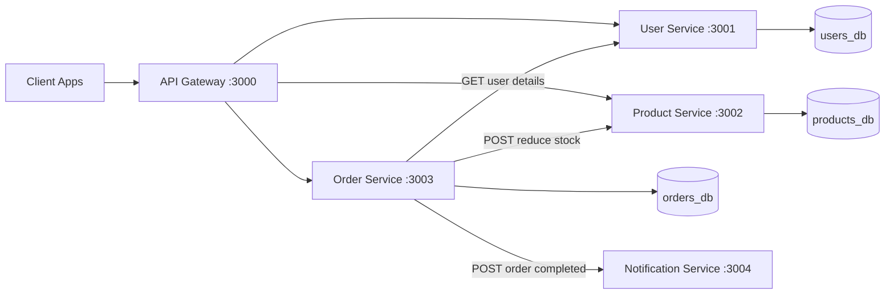
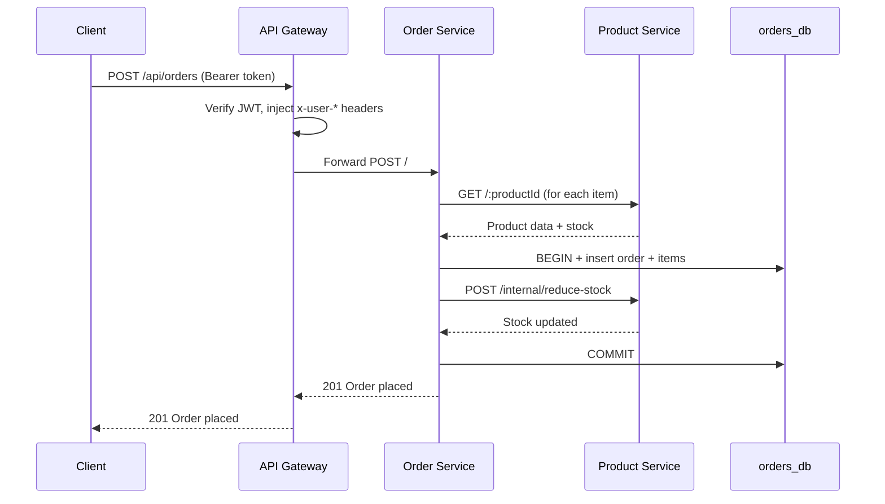
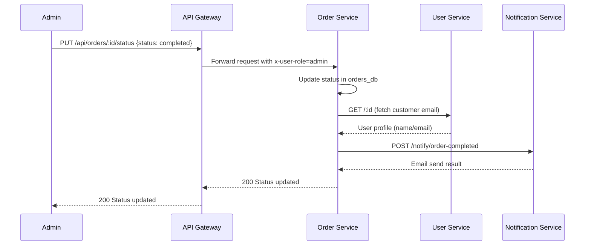

# E-Commerce Microservices

Production-style microservices backend for e-commerce, built with Node.js, FastAPI, PostgreSQL, and Docker Compose.

The system demonstrates:
- API gateway routing with JWT verification and user context propagation
- Correlated structured logging with centralized aggregation in Grafana Loki
- Database-per-service ownership
- Synchronous service-to-service orchestration for order placement
- Event-like notification trigger on order completion

## 1) System Design

### High-Level Architecture



### Request Flow (Create Order)



### Request Flow (Order Completion Notification)



## 2) Tech Stack

- API Gateway: Express + http-proxy-middleware + jsonwebtoken + express-rate-limit
- User Service: Express + PostgreSQL + bcryptjs + JWT
- Product Service: Express + PostgreSQL
- Order Service: Express + PostgreSQL + Axios
- Notification Service: FastAPI + SMTP (Gmail-compatible)
- Infrastructure: Docker Compose + PostgreSQL 15
- Observability: Grafana Loki + Grafana Alloy + Grafana

## 3) Service Responsibilities

### API Gateway
- Single external entrypoint on port 3000
- Auth middleware validates bearer tokens except explicitly public routes
- Injects user context headers to downstream services:
  - x-user-id
  - x-user-email
  - x-user-role
- Proxies:
  - /api/users -> user-service
  - /api/products -> product-service
  - /api/orders -> order-service

### User Service
- Register and login users
- Store hashed passwords
- Return profile for authenticated users
- Internal lookup endpoint for other services: GET /:id

### Product Service
- Public catalog browsing with filtering/pagination
- Admin-managed create/update/delete
- Internal stock decrement endpoint: POST /internal/reduce-stock

### Order Service
- Place orders for authenticated users
- Validates product existence and stock
- Persists orders and order items transactionally
- Calls product-service to reduce inventory
- Admin can update order status
- Triggers notification-service when status becomes delivered or completed

### Notification Service
- Exposes POST /notify/order-completed
- Sends order completion emails via SMTP

## 4) Run Locally

### Prerequisites
- Docker Desktop (or Docker Engine + Compose plugin)

### Start everything

```bash
docker compose up --build
```

Gateway will be available at:
- http://localhost:3000

Centralized logs will be available at:
- Grafana: http://localhost:3005
- Loki API: http://localhost:3100

Grafana default credentials:
- username: admin
- password: admin

### Stop everything

```bash
docker compose down
```

### Reset with clean databases

```bash
docker compose down -v
```

## 5) Environment and Secrets

Notification service reads SMTP settings from:
- notification-service/.env.example (currently mounted as env_file in compose)

Required variables:

```env
SMTP_HOST=smtp.gmail.com
SMTP_PORT=587
SMTP_USER=your-email@example.com
SMTP_PASSWORD=your-app-password
SMTP_FROM_EMAIL=your-email@example.com
```

Important:
- Use an App Password for Gmail, not your regular account password.
- Do not commit real SMTP credentials to source control.
- If credentials are already exposed, rotate them immediately.

## 6) Exposed Ports

- 3000 -> api-gateway
- 3005 -> grafana
- 3100 -> loki
- 5433 -> users-db
- 5434 -> products-db
- 5435 -> orders-db

Service ports 3001-3004 are internal to the Docker network.

## 7) Centralized Logging

All services now emit JSON logs to stdout with:
- service name
- timestamp
- log level
- request ID (`x-request-id`)
- request path and method
- response status and duration

The API gateway generates a request ID when one is not provided and propagates it to downstream services. The order service also forwards the same request ID to internal calls made to user-service, product-service, and notification-service. That lets you trace a single order flow across the full stack in Grafana.

In Grafana Explore, a useful starting query is:

```logql
{stack="ecommerce"}
```

To isolate a single request end-to-end, filter by request ID:

```logql
{stack="ecommerce"} |= "<request-id>"
```

## 8) Authentication Model

Gateway public routes:
- POST /api/users/register
- POST /api/users/login
- GET /api/products
- GET /api/products/:id
- GET /health

All other gateway routes require:

```http
Authorization: Bearer <jwt-token>
```

Role authorization is enforced by downstream services using x-user-role, especially for admin-only operations.

## 9) API Reference

Base URL:
- http://localhost:3000

### Public Endpoints

#### Register user

```http
POST /api/users/register
Content-Type: application/json
```

Body:

```json
{
  "name": "Alice",
  "email": "alice@example.com",
  "password": "secret123",
  "role": "user"
}
```

#### Login

```http
POST /api/users/login
Content-Type: application/json
```

Body:

```json
{
  "email": "alice@example.com",
  "password": "secret123"
}
```

#### Browse products

```http
GET /api/products
GET /api/products?category=Electronics
GET /api/products?search=keyboard&page=1&limit=10
GET /api/products/:id
```

### Authenticated Endpoints

#### User profile

```http
GET /api/users/profile
Authorization: Bearer <token>
```

#### Create order

```http
POST /api/orders
Authorization: Bearer <token>
Content-Type: application/json
```

Body:

```json
{
  "items": [
    { "productId": 1, "quantity": 2 },
    { "productId": 3, "quantity": 1 }
  ]
}
```

#### Get my orders

```http
GET /api/orders
Authorization: Bearer <token>

GET /api/orders/:id
Authorization: Bearer <token>
```

### Admin Endpoints

#### Create product

```http
POST /api/products
Authorization: Bearer <admin-token>
Content-Type: application/json
```

#### Update/Delete product

```http
PUT /api/products/:id
DELETE /api/products/:id
Authorization: Bearer <admin-token>
```

#### Update order status

```http
PUT /api/orders/:id/status
Authorization: Bearer <admin-token>
Content-Type: application/json
```

Body:

```json
{ "status": "completed" }
```

Valid statuses:
- pending
- confirmed
- shipped
- delivered
- completed
- cancelled

Notification dispatch is attempted when status is delivered or completed.

## 9) Health Checks

External:

```http
GET http://localhost:3000/health
```

Internal Docker network checks:

```http
GET http://user-service:3001/health
GET http://product-service:3002/health
GET http://order-service:3003/health
GET http://notification-service:3004/health
```

## 10) Developer Commands

### Logs

```bash
docker compose logs -f api-gateway
docker compose logs -f user-service
docker compose logs -f product-service
docker compose logs -f order-service
docker compose logs -f notification-service
```

### Rebuild one service

```bash
docker compose up --build api-gateway
docker compose up --build user-service
docker compose up --build product-service
docker compose up --build order-service
docker compose up --build notification-service
```

### Database shells

```bash
docker exec -it users-db psql -U postgres -d users_db
docker exec -it products-db psql -U postgres -d products_db
docker exec -it orders-db psql -U postgres -d orders_db
```

## 11) Troubleshooting

### POST requests hang at gateway

If gateway parses request bodies before proxying, downstream services may receive empty/invalid streams. This project uses proxy body fixing in gateway proxy middleware to prevent that issue.

### 401 Unauthorized

- Confirm Authorization header format is exactly: Bearer <token>
- Ensure token was generated with the same JWT secret used by gateway and services

### Notification errors

- Verify SMTP credentials
- Verify provider allows SMTP access and app passwords

## 12) Future Improvements

1. Replace synchronous HTTP chaining with a message broker (RabbitMQ or Kafka)
2. Add OpenTelemetry tracing across gateway and services
3. Introduce retries and circuit breaker patterns for outbound service calls
4. Add automated tests (unit, integration, contract)
5. Add centralized logging and dashboards (ELK/Loki + Grafana)
